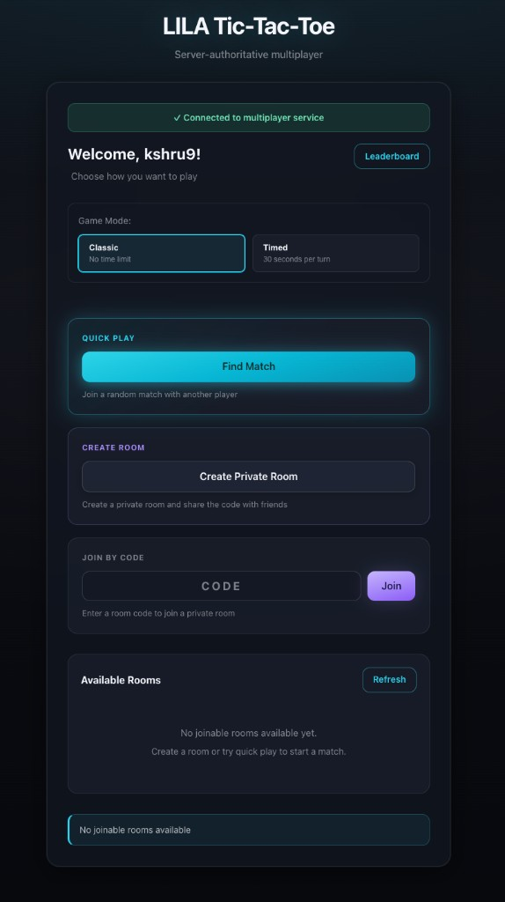
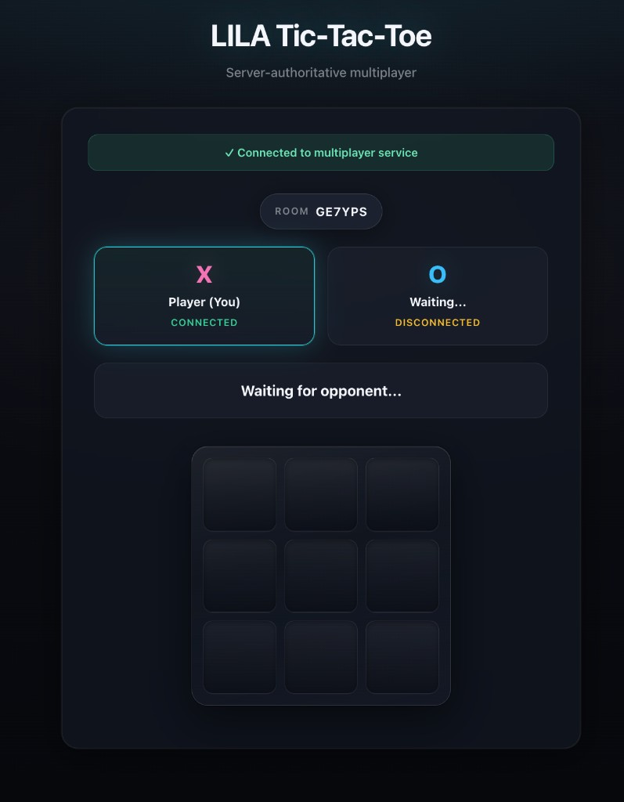
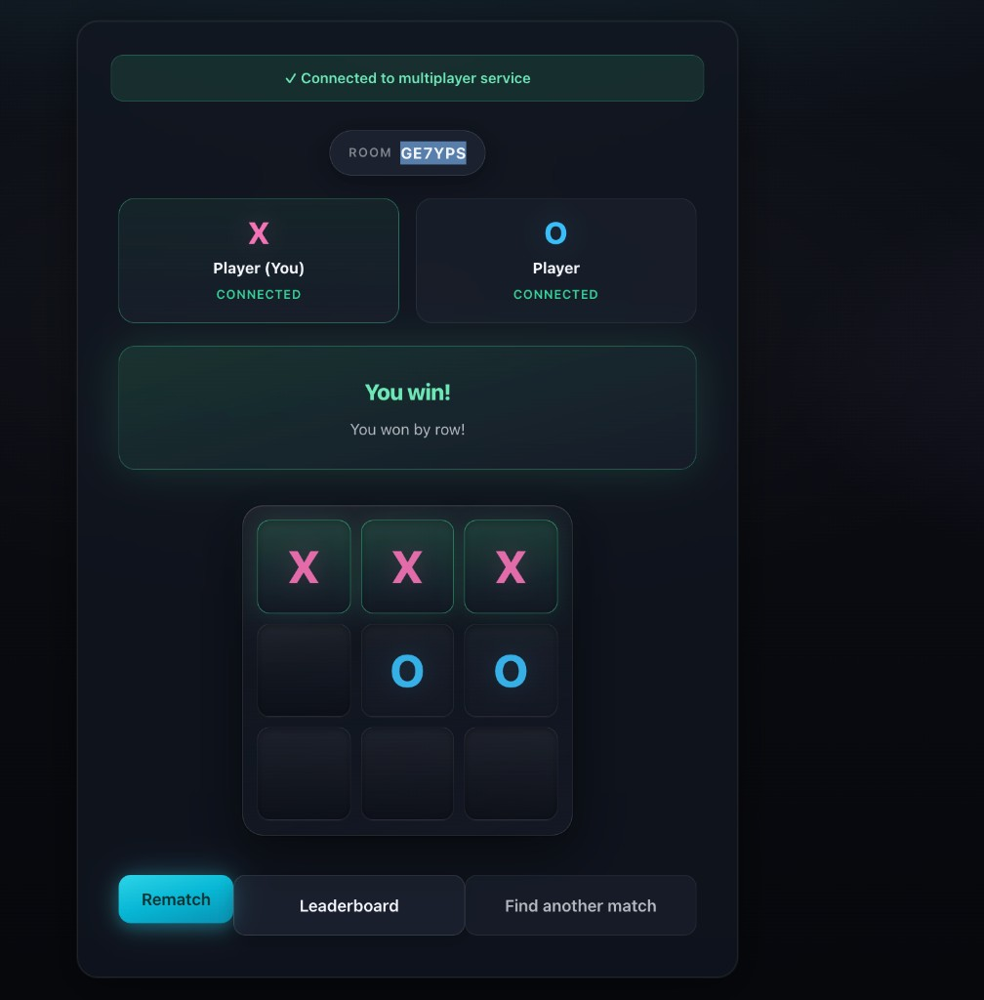
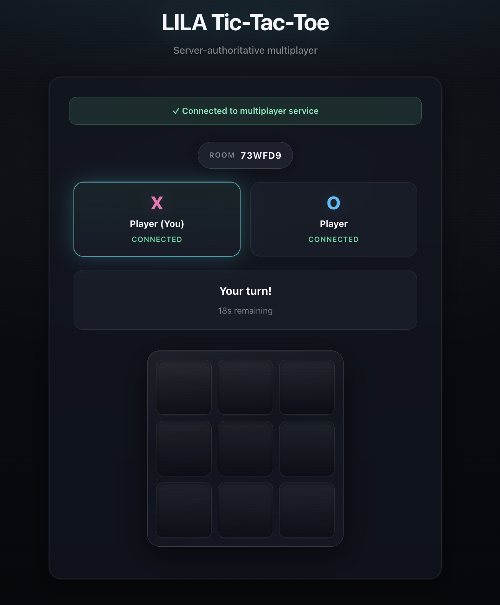
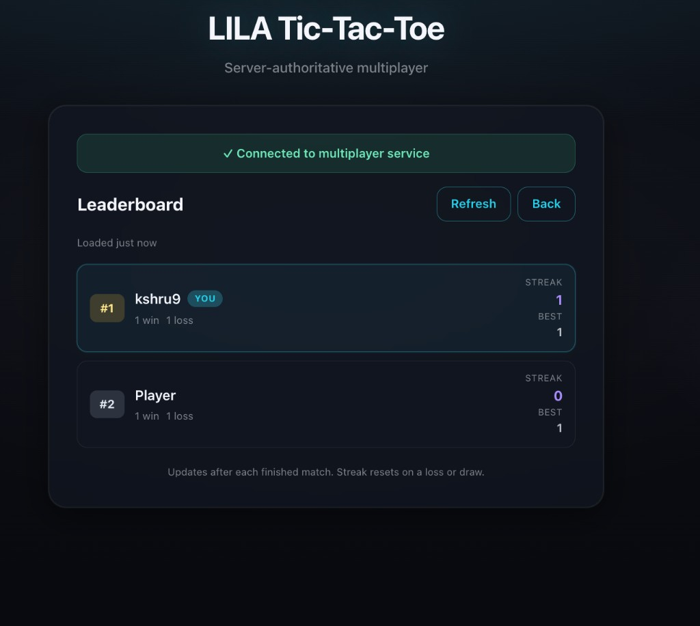
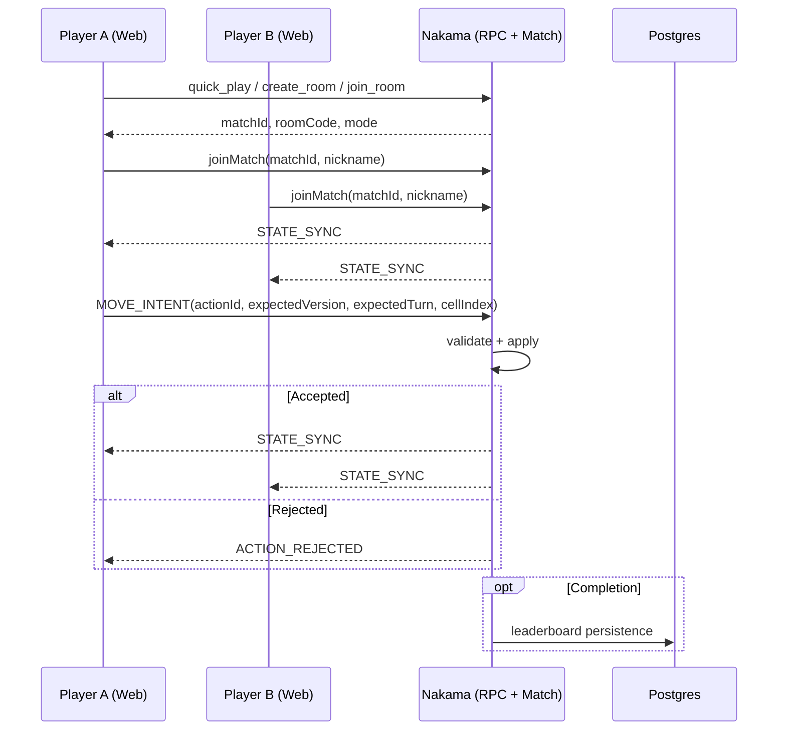

# LILA Multiplayer Tic-Tac-Toe (Server-Authoritative Nakama)

A production-minded, server-authoritative multiplayer Tic-Tac-Toe built with **React + TypeScript + Vite** on the frontend and **Nakama** on the backend.

This submission is designed to show more than a working board. It demonstrates authoritative multiplayer state management, rooming/matchmaking, reconnect handling, timed mode, and reviewer-friendly deployment/documentation.

---

## Live Deployment

Replace these before submission:

- **Live Frontend (GitHub Pages):** https://kshru9.github.io/tic-tac-toe-lila/
- **Deployed Nakama Endpoint (Railway):** https://handsome-courage-production-d68e.up.railway.app/
- **Demo Video (Loom):** https://www.loom.com/share/742fc09035ff42299802a0f32351d3ba

---

## Assignment Coverage

### Core requirements
- ✅ Responsive UI optimized for mobile devices
- ✅ Real-time multiplayer game state updates
- ✅ Player information and match status visibility
- ✅ Server-authoritative game logic on Nakama
- ✅ Server-side move validation and cheat prevention
- ✅ Room creation
- ✅ Automatic matchmaking / Quick Play
- ✅ Room discovery and joining
- ✅ Graceful disconnect / reconnect handling
- ✅ Public frontend deployment + backend deployment documentation

### Bonus / optional features implemented
- ✅ Concurrent room isolation through one Nakama match instance per room
- ✅ Timed mode with **30-second server-authoritative turns**
- ✅ Automatic timeout forfeit
- ✅ Mode-aware matchmaking (`classic` vs `timed`)
- ✅ Persistent leaderboard with wins / losses / draws / streaks
- ✅ QR-based room sharing
- ✅ Hidden debug overlay via `?debug=1`
- ✅ Rematch handshake flow
- ✅ Refresh-to-resume / session persistence

---

## Screenshots

### Lobby Interface

*Players can enter nicknames and choose between Quick Play, Create Room, Join by Code, or Room Discovery.*

### Classic Match Gameplay

*Real-time Tic-Tac-Toe gameplay with turn indicators and board state in classic mode.*

### Winning interface 

*Visual interface showing winning screen*

### Timed Match Gameplay  

*Timed mode with server-authoritative 30-second turn deadlines and countdown display.*

### Leaderboard

*Leaderboard showing the ranked players and their streak*

---

## Tech Stack

### Frontend
- React
- TypeScript
- Vite
- CSS-based responsive/mobile-first UI

### Backend
- Nakama TypeScript runtime
- Server-authoritative match handler
- RPC endpoints for rooming, matchmaking, and leaderboard access

### Infrastructure
- Docker Compose for local development
- PostgreSQL for Nakama persistence
- Railway for backend deployment
- GitHub Pages for frontend deployment

---

## Repository Structure

```text
tic-tac-toe/
├── README.md
├── .env.example
├── docker-compose.yml
├── railway.json
├── DEPLOYMENT-STEPS.md
├── FLAG-FIX-SUMMARY.md
├── assets/
│   ├── screenshot1-lobby.png
│   ├── screenshot2-gameplay.png
│   ├── screenshot3-win.png
│   └── screenshot4-reconnect.png
├── scripts/
│   ├── dev.sh
│   └── deploy.sh
├── nakama/
│   ├── Dockerfile
│   ├── package.json
│   ├── tsconfig.json
│   ├── start.sh
│   ├── start-railway.sh
│   └── src/
│       ├── index.ts
│       ├── rpc.ts
│       ├── gameRules.ts
│       ├── ticTacToeMatch.ts
│       └── leaderboard.ts
└── web/
    ├── package.json
    ├── vite.config.ts
    ├── index.html
    ├── public/
    │   └── screenshots/
    │       ├── lobby.png
    │       ├── create-room-qr.png
    │       ├── match-classic.png
    │       ├── match-timed.png
    │       ├── reconnect-grace.png
    │       ├── leaderboard.png
    │       └── debug-overlay.png
    └── src/
        ├── main.tsx
        ├── App.tsx
        ├── Lobby.tsx
        ├── MatchView.tsx
        ├── LeaderboardView.tsx
        ├── Board.tsx
        ├── nakamaClient.ts
        ├── types.ts
        └── theme.css
```

---

## Architecture Overview

### High-level model

* The **client renders state and sends intents**.
* The **Nakama match handler owns gameplay truth**.
* The server validates moves, applies legal state transitions, and broadcasts canonical match state.
* The client never authoritatively decides wins, turn ownership, timeout outcomes, or reconnect outcomes.

### Why this architecture

This design keeps the trust boundary clear:

* **Frontend responsibilities**

  * nickname entry
  * authentication/session restore
  * room/join UX
  * render authoritative state
  * send move/rematch intents
  * show pending / rejected / reconnect / timeout messaging

* **Backend responsibilities**

  * room lifecycle
  * seat ownership
  * turn ownership
  * move validation
  * win/draw detection
  * reconnect grace
  * timed-mode deadlines
  * timeout and disconnect forfeits
  * leaderboard persistence

---

## Gameplay and Rooming Flow

### 1. Quick Play

Quick Play attempts to find a compatible public waiting room for the selected mode. If none exists, it creates one.

### 2. Create Room

A player can create a room and receive:

* a 6-character room code
* a shareable link
* a QR code for quick join

### 3. Join by Code

Another player can join directly using the room code.

### 4. Room Discovery

Public waiting rooms can be listed and joined from the lobby.

### 5. Deep Link Join

Room links use query parameters like:

```text
?room=ABC123&mode=classic
?room=ABC123&mode=timed
```

### 6. Match Lifecycle

The gameplay model includes these states:

* `waiting_for_opponent`
* `ready`
* `in_progress`
* `reconnect_grace`
* `completed`
* `rematch_pending`

---

## Server-Authoritative Design

### Move validation

All moves are validated on the server before they are applied.

Examples of rejection reasons include:

* not your turn
* cell already occupied
* game not in progress
* invalid payload
* stale state / duplicate action
* reconnect in progress

The client sends **move intent**, then waits for:

* authoritative state sync, or
* an action rejection payload

### Protocol hardening

The implementation includes:

* monotonic state versioning
* action IDs
* expected version / expected turn checks
* duplicate/stale action rejection

This makes the multiplayer protocol more reliable under reconnects, retries, and delayed messages.

---

## Timed Mode

Timed mode is fully server-authoritative.

* Turn budget: **30 seconds**
* The server owns the deadline via an absolute turn timestamp
* The client renders countdown based on server state
* If a player does not act before deadline, the server applies **timeout forfeit**

This avoids client-side timer authority and keeps timing fair for both players.

---

## Reconnect, Refresh, and Failure Handling

### Reconnect grace

If a player disconnects during a live match:

* their seat remains reserved temporarily
* the match enters reconnect grace
* the opponent sees reconnect state/countdown
* if the player returns in time, the match resumes
* if not, the server resolves disconnect forfeit

### Refresh-to-resume

The client persists:

* identity
* session
* active match context
* pending join / room intent

Refreshing the page attempts to resume the active match safely rather than dropping the player back to square one.

### Intentional failure states

The UI is designed to make failure visible rather than silent:

* room not found
* room full
* invalid room code
* stale join link
* move rejected
* reconnect in progress
* timeout / disconnect outcomes

---

## Leaderboard

The leaderboard is an additive bonus feature and is updated only from authoritative match completion.

Tracked statistics include:

* wins
* losses
* draws
* current streak
* best streak

The leaderboard UI is read-only from the client side. Writes happen on the backend after eligible match completion.

---

## Rematch

After a completed match, players can rematch through a **two-party handshake**:

* one player requests rematch
* the other player accepts
* the backend resets board state and starts a fresh match in the same room context

This keeps rematch behavior deterministic and avoids accidental resets.

---

## Debug Overlay

A hidden reviewer/debug feature is available through:

```text
?debug=1
```

When enabled during a match, it can expose useful authoritative fields such as:

* match ID
* room code
* mode
* phase
* version
* reconnect deadline
* turn deadline
* pending move
* stats commit state

This is useful for demos and debugging without requiring a separate debug RPC surface.

---

## Flow Diagram



---

## RPC Endpoints

The backend registers these RPCs:

* `health`
* `create_room`
* `join_room`
* `list_rooms`
* `quick_play`
* `get_leaderboard`

---

## Match Opcodes

The gameplay protocol uses these opcodes:

* `1` — `MOVE_INTENT`
* `2` — `STATE_SYNC`
* `3` — `ACTION_REJECTED`
* `4` — `REMATCH_REQUEST`
* `5` — `REMATCH_ACCEPT`

---

## Key Code References

### Backend

* `nakama/src/index.ts` — runtime initialization, RPC registration, match registration
* `nakama/src/rpc.ts` — room creation, room join, room listing, quick play, leaderboard read
* `nakama/src/gameRules.ts` — pure board/game outcome logic
* `nakama/src/ticTacToeMatch.ts` — authoritative match loop, reconnect grace, timer handling, rematch flow
* `nakama/src/leaderboard.ts` — leaderboard persistence and ranking

### Frontend

* `web/src/App.tsx` — app bootstrap, deep-link handling, top-level state/view transitions
* `web/src/Lobby.tsx` — lobby actions, mode selection, QR flow, room discovery
* `web/src/MatchView.tsx` — match UI, timer rendering, reconnect status, rejection messages, debug overlay
* `web/src/LeaderboardView.tsx` — leaderboard screen
* `web/src/nakamaClient.ts` — client auth/session restore, RPC calls, socket lifecycle, resume logic
* `web/src/types.ts` — shared protocol/types

---

## Local Setup

### Prerequisites

* Docker
* Docker Compose
* Node.js 18+
* Git

### 1. Clone and prepare environment

```bash
git clone https://github.com/kshru9/tic-tac-toe-lila.git
cd tic-tac-toe-lila
cp .env.example .env
```

### 2. Build the Nakama runtime

```bash
cd nakama
npm install
npm run build
cd ..
```

### 3. Start local backend services

```bash
docker-compose up
```

This starts:

* PostgreSQL
* Nakama

### 4. Start the frontend

In another terminal:

```bash
cd web
npm install
npm run dev
```

### Local URLs

* **Frontend:** `[private-url-redacted]`
* **Nakama HTTP:** `[private-url-redacted]`
* **Nakama WebSocket:** `ws://[private-host-redacted]:7350`
* **PostgreSQL:** `[private-host-redacted]:5432`

---

## Environment Variables

### Frontend

| Variable                     |        Required | Purpose                                            |
| ---------------------------- | --------------: | -------------------------------------------------- |
| `VITE_NAKAMA_HOST`           |             Yes | Nakama host for HTTP / socket connection           |
| `VITE_NAKAMA_PORT`           |              No | Nakama port, defaults to `7350`                    |
| `VITE_NAKAMA_SERVER_KEY`     |             Yes | Must match backend server key                      |
| `VITE_NAKAMA_USE_SSL`        |             Yes | `false` locally, `true` in production              |
| `VITE_NAKAMA_WEBSOCKET_PORT` |              No | Optional; usually same as HTTP port                |
| `VITE_BASE_PATH`             | Production only | Needed for GitHub Pages project path               |
| `VITE_APP_TITLE`             |              No | Present in env template, not currently used by app |

### Backend / deployment

| Variable              |                       Required | Purpose                                            |
| --------------------- | -----------------------------: | -------------------------------------------------- |
| `DATABASE_URL`        |                           Yes* | Primary Railway/Postgres connection input          |
| `NAKAMA_RUNTIME_PATH` |                            Yes | Path to compiled runtime modules                   |
| `NAKAMA_SERVER_KEY`   |                            Yes | Must match frontend key                            |
| `NAKAMA_CORS_ORIGIN`  | Recommended in deployment docs | Configure CORS appropriately for deployed frontend |

* Railway may provide either `DATABASE_URL` or equivalent `PG*` variables depending on setup.

---

## How to Test Multiplayer

Use two browser contexts:

* one normal window
* one incognito window

Recommended test checklist:

1. **Quick Play**

   * Player A joins Quick Play
   * Player B joins Quick Play
   * Verify both enter the same match

2. **Create private room**

   * Create room
   * copy room code / share link
   * verify room code is visible

3. **Join by code**

   * Enter valid code in second window
   * verify match starts

4. **Room discovery**

   * Create a public room
   * refresh room list
   * join from second client

5. **Authoritative rejection**

   * attempt move out of turn
   * click an occupied cell
   * verify rejection messaging

6. **Reconnect grace**

   * disconnect one player mid-match
   * verify reconnect state/countdown
   * reconnect within grace window

7. **Refresh-to-resume**

   * refresh during active match
   * verify resume flow attempts to restore state

8. **Timed mode**

   * select `timed`
   * verify countdown appears
   * let timer expire
   * verify timeout forfeit result

9. **Rematch**

   * finish a match
   * request rematch from one side
   * accept from the other
   * verify board resets

10. **Leaderboard**

* finish match
* open leaderboard
* verify updated stats

11. **Debug overlay**

* add `?debug=1`
* verify debug panel appears during match

---

## Deployment

### Backend: Railway

The repository is configured to deploy Nakama to Railway using:

* `railway.json`
* `nakama/Dockerfile`
* `nakama/start-railway.sh`

Expected deployment shape:

* Railway service root directory: `/nakama`
* PostgreSQL attached to Railway project
* environment variables configured for database + server key + runtime path
* HTTPS/WSS endpoint exposed publicly

### Frontend: GitHub Pages

The repository includes a GitHub Actions workflow for Pages deployment:

* `.github/workflows/deploy-pages.yml`

Important notes:

* the production base path is derived from repo name via `VITE_BASE_PATH`
* the primary intended Pages workflow is `deploy-pages.yml`
* `.github/workflows/static.yml` exists but appears to be a conflicting/duplicate static workflow and should not be the primary deployment path

### Health check

The repo includes:

* a custom `health` RPC in the Nakama runtime
* a Railway healthcheck path configured at `/health`

For submission wording, it is safest to describe `/health` as the configured deployment healthcheck path and verify the exact deployed response contract in the live environment.

---

## Submission Checklist

Before submitting:

* add live frontend URL
* add live Nakama endpoint
* add Loom demo link
* add screenshots
* confirm production frontend connects successfully to deployed Nakama
* confirm CORS is configured correctly for the deployed frontend domain
* verify health check in deployed environment
* verify HTTPS/WSS connectivity
* re-test timed mode, reconnect grace, leaderboard update, and rematch in the live environment

---

## Known Notes / Careful Wording

* The code/config inspection indicates timed mode, leaderboard, rematch, QR join, and debug overlay are implemented, even though the older README underreported them.
* `VITE_NAKAMA_HOST` should be set explicitly; the client should not rely on guessing production backend location.
* `NAKAMA_SERVER_KEY` should be changed from insecure defaults in real deployment.
* `VITE_NAKAMA_WEBSOCKET_PORT` exists in config but may not materially differ from the main Nakama port in practice.
* CORS setup should be verified against the actual deployed frontend origin.
* Production deployment status, exact public URLs, and exact `/health` response shape should be manually confirmed before final submission/demo.

---

## Why this submission is structured this way

This project was intentionally built as a compact but production-minded multiplayer system:

* lean repo shape
* clear trust boundary
* explicit match lifecycle
* reconnect-aware UX
* mode-aware matchmaking
* additive bonus features without destabilizing the core

The goal is not to over-engineer Tic-Tac-Toe. The goal is to show solid multiplayer/backend thinking, good product judgment, and end-to-end ownership.

---

## License

MIT
